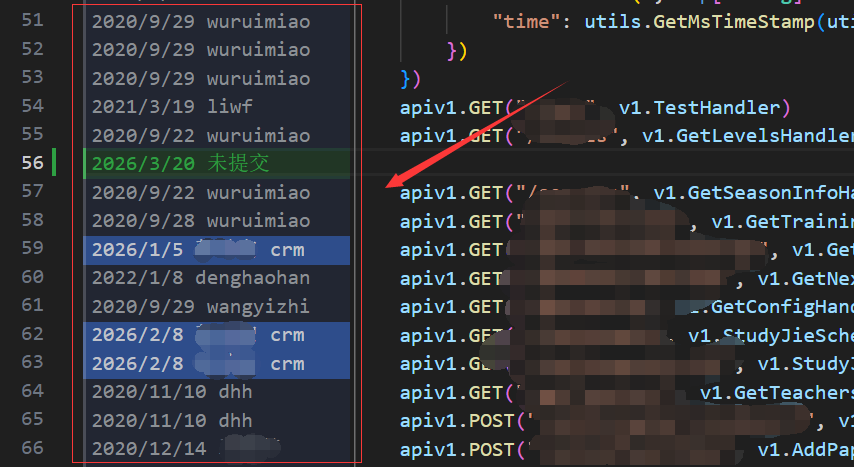

# GitBlms

[English](./README.md) | [简体中文](./README.zh-CN.md)

GitBlms is a VS Code extension that brings a GoLand-style inline Git blame experience into the editor.

## Home

- Repository: [https://github.com/gee-coder/git-blms.git](https://github.com/gee-coder/git-blms.git)
- Issues: [https://github.com/gee-coder/git-blms/issues](https://github.com/gee-coder/git-blms/issues)

## 1.0.0 Highlights

- GoLand-inspired left-side blame column with stable layout
- Age-based color buckets that make new and old code easy to scan at a glance
- Hover details for author, commit time, hash, and summary
- `git blame --contents -` support for unsaved editor content
- Dedicated configurable style for uncommitted lines
- Optional current-author highlight color that keeps age buckets but uses your own accent palette
- Built-in Chinese and English runtime text, plus a custom extension icon

## Preview



## Features

- Stable left-side blame column that shows date and author per line
- Bucketed age colors that emphasize visual contrast instead of a simple alpha fade
- Hover-only commit details on the blame area to avoid blocking the code editor
- Large-file guardrails and blame caching to reduce performance cost
- Configurable maximum annotation width for compact blame layout

## Install

1. Install the extension from the packaged `.vsix` file or your release artifact.
2. Open a Git-managed workspace in VS Code.
3. Run `Git: Toggle Inline Git Blame` from the command palette.

Default keybinding:

- Windows / Linux: `Ctrl+Alt+B`
- macOS: `Cmd+Alt+B`

## Commands

- `Git: Toggle Inline Git Blame`
- `Git: Show Inline Git Blame`
- `Git: Hide Inline Git Blame`
- `Git: Open Commit Details`

## Configuration

| Setting | Default | Description |
| --- | --- | --- |
| `git-blms.enabled` | `false` | Enables inline blame annotations globally |
| `git-blms.colorScheme` | `"blue"` | Annotation palette: `blue`, `green`, `purple` |
| `git-blms.dateFormat` | `"absolute"` | `relative` or `absolute` timestamp display |
| `git-blms.maxLineCount` | `5000` | Skip blame rendering for very large files |
| `git-blms.cacheTimeout` | `60000` | Blame cache lifetime in milliseconds |
| `git-blms.maxAnnotationWidth` | `22` | Maximum width of the blame column in `ch` |
| `git-blms.uncommittedColor` | `"46,160,67"` | Color for uncommitted lines. Supports CSV, `rgb(...)`, and hex |
| `git-blms.currentAuthorColor` | `""` | Optional highlight color for lines authored by the current Git user. Keeps age buckets and leaves the feature disabled when empty |
| `git-blms.language` | `"auto"` | UI language: `auto`, `zh-CN`, `en` |

## Notes

VS Code decorations can render a stable info column before code and provide hover details, but they cannot fully reproduce GoLand's clickable gutter text. Easy Git therefore takes the closest practical approach:

- A fixed blame column before code
- Time-bucketed colors with stronger contrast
- Commit actions through hover links and the command palette

## Development

```bash
npm install
npm run compile
npm test
```

Press `F5` to launch the extension development host.

## Open VSX Publishing

The repo includes a PowerShell helper script for Open VSX publishing:

```bash
npm run package:vsix
npm run publish:openvsx
```

If you need to create the publisher namespace first:

```bash
npm run publish:openvsx:namespace
```

The script reads the token from `OPENVSX_TOKEN` or `OVSX_PAT`, and it also supports passing `-Token` manually to `./scripts/publish-openvsx.ps1`.

## GitHub Actions

The repository includes an automated Open VSX workflow at `.github/workflows/publish-openvsx.yml`.

- Trigger: pushing a tag like `v1.0.1`
- Manual trigger: GitHub Actions `workflow_dispatch`
- Required secret: `OPENVSX_TOKEN`

Once `OPENVSX_TOKEN` is configured in the repository secrets, pushing a new version tag will automatically lint, test, package, and publish the extension to Open VSX.
